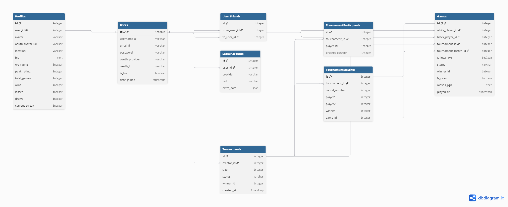

**_This project has been created as part
of the 42 curriculum by hhurnik, wzielins, jkalinow, mmitkovi, hgatarek_**


# Description

Team-based, final Core Curriculum project in 42 Warsaw coding academy. Assignment was about creating single page application which transcend members more into full-stack developers. While having modular approach and key architectural decisions to make, it also demonstrates technical depth and big-picture-creativity. Our team decided to go with **web chess platform - Chess42** with 1vs1, multiplayer with spectators mode, AI opponent and more. We attempted to build enterprise-grade, easy scalable architecture with the code as robust and clean as we possibly could develop.

### 1v1 Multiplayer

The multiplayer mode is a real-time chess arena built on WebSockets. It handles live moves, timers, and player interactions (draws, rematches, resignations) without HTTP polling.

- **Real-Time Communication (WebSockets):** The frontend uses a custom React hook  (`useGameReconnectSocket`) to maintain a persistent connection, but the heavy lifting is handled by FastAPI and Redis Pub/Sub. When a move is made, FastAPI instantly broadcasts the JSON payload through Redis to the opponent's WebSocket, completely bypassing slow HTTP polling. The server pushes JSON events (`move`, `board_state`, `draw_offer`), and the frontend updates the React state (FEN string, timers, move history) to trigger instant UI re-renders.

- **Move Validation** (The "Source of Truth"): While the frontend uses chess.js for visual drag-and-drop feedback, our FastAPI backend acts as the impenetrable Referee. Using python-chess, the backend strictly recalculates and validates every incoming move. If a move is illegal, the server rejects it and forces the frontend board to snap back to the true Server State, making cheating impossible.

- **Chess Clocks & The Arbiter**: the frontend visualizes the timer via a 1-second `setInterval`, but the actual time is securely tracked in Redis RAM using server-side timestamps. When a player's clock hits zero and the frontend sends a claim_timeout payload, our backend "Arbiter" function mathematically verifies the elapsed time before officially declaring a winner.

- **Event-Driven Tournaments**: The backend engine reads the game state to enforce strict tournament rules (e.g., disabling mutual draws). When a tournament game ends, an event-driven progression system (advance_tournament) checks the PostgreSQL bracket, automatically generates the next round of matches, and pushes a WebSocket redirect to the surviving players. From the frontend perspective, the component reads the initial server payload to check if the match is part of a tournament, dynamically hiding UI elements (like the "Offer Draw" button) to enforce strict tournament rules.

- **Post-Game Architecture**: Upon checkmate or surrender, FastAPI generates the official PGN history, asynchronously commits the game to its PostgreSQL database (fastapi_db), and makes a secure internal REST API call to Django (django_db) to recalculate and update the players' ELO ratings. From the frontend perspective, actions like offering a draw, resigning, or requesting a rematch send specific string payloads over the socket, triggering modal popups on the opponent's screen.


### Single-Player vs. AI

The single-player mode delivers a stable, low-latency chess match against a custom-built, server-side AI that survives unexpected browser interruptions.

- **The AI Engine (Minimax)**: Our AI is not a 3rd-party library. It is a custom-built recursive Minimax algorithm with Alpha-Beta pruning. It evaluates millions of board states by analyzing material point values and positional heuristics (e.g., prioritizing center-board control and penalizing edge-knights). We restricted it to Depth 4 to simulate challenging, human-like, imperfect play.

- **CPU Isolation**: Because calculating chess trees is highly CPU-bound, the AI logic runs entirely inside the FastAPI microservice. This guarantees that heavy bot computations never block the Django Auth server from serving other users.

- **Session Survival (Redis State)**: If a user accidentally closes their laptop or refreshes the page mid-match, the game is not lost. While React uses sessionStorage to trigger a reconnect, the true game state (FEN strings and move history) is safely frozen in Redis. The exact millisecond the WebSocket re-establishes, FastAPI fetches the data from Redis and flawlessly restores the board to its exact previous state.

- **Game Board (`chess.js`):** The visual chessboard uses the `chess.js` library to act as a real-time local referee. It instantly blocks illegal moves, highlights legal destinations/captures, and flashes a red warning on the King during check.
- **Real-Time AI Connection:** Gameplay runs over a continuous WebSocket connection. As soon as you make a legal move, the backend engine calculates its response and instantly pushes the updated FEN string back to the UI without loading lag.


## Database scheme



# Architecture summary and technology justification

For this project, we have chosen a **loosely-coupled microservices architecture**, separating our backend into two distinct services: an Authentication/Admin service and a Real-Time Game/AI service. This design ensures fault isolation, allows parallel team development and adheres strictly to the "Single Responsibility" principle. Entire project is built around microservices idea, which takes application to enterprise level, allows scalability while being immune to big breakdowns.

### 1. Django (Auth & Core Data Microservice)

Handles user management, OAuth2 authentication, profile CRUD operations, and serves the REST API.
Django is a "batteries-included" framework. For standard I/O-bound web tasks (like querying users or verifying passwords), it is unparalleled. It provides a highly secure, built-in admin panel and a robust ORM out-of-the-box, saving us weeks of development time on user permissions and security.

### 2. FastAPI (Game Engine & AI Microservice)

Handles real-time WebSockets, live multiplayer matchmaking, and CPU-intensive Artificial Intelligence (Minimax/Machine Learning).
Traditional web frameworks struggle with real-time, heavy-computation tasks. FastAPI is natively asynchronous and incredibly lightweight. By isolating our CPU-bound AI math and persistent WebSocket connections here, we ensure that a heavy chess calculation will never freeze the main Django server or prevent other users from logging into the website.

### 3. PostgreSQL (The Persistence Layer)

The central, relational database storing users, match histories, and tournament brackets.
A chess platform requires strict data integrity (e.g., a game cannot exist without two valid users). PostgreSQL is the industry standard for ACID-compliant (Atomicity, Consistency, Isolation, Durability), relational data.
To maintain strict microservice separation without overloading the host machine's RAM, we will run a single PostgreSQL Docker container, but initialize it with two separate logical databases (django_db and fastapi_db). This guarantees that our microservices remain completely independent at the data level.

### 4. Redis (The Message Broker, Matchmaking and Board State Fallback)

The "central nervous system" connecting the microservices.
Because Django and FastAPI have separate databases and run in different containers, they communicate asynchronously via Redis Pub/Sub. It also acts as an ultra-fast, in-memory queue for our matchmaking system and temporarily stores live game states to protect against sudden user disconnections.

### 5. React (The Client-Side Application)

The frontend is a Single Page Application (SPA) that splits network logic from visual components.

- **Secure Authentication & Token Rotation:** An Axios network interceptor acts as a gatekeeper. It automatically injects JWT Bearer tokens into secure requests and invisibly refreshes expired sessions in the background without interrupting the user.
- **Global State Memory:** A custom Context Provider (`AuthProvider`) holds the application's active memory, instantly broadcasting the user's login status to the navigation bar, game lobbies, and router guards.
- **Strict Routing Guards:** Dedicated React Router wrapper components block unauthenticated users from accessing active game pages and redirect logged-in users away from redundant login screens.

# Libraries used

**Backend Core & Architecture**

- Django REST Framework (DRF) & SimpleJWT**: Used to rapidly build the JSON API endpoints and provide stateless, mathematically verifiable JWT tokens.

- django-allauth & dj-rest-auth: Handled the complex OAuth2 callback flow for GitHub login, bridging the gap between social authentication and our React SPA.

- SQLModel / SQLAlchemy: To fulfill "Use an ORM" module, we used Django's built-in ORM for the Auth microservice, and SQLModel (an async SQLAlchemy wrapper) for the FastAPI microservice.

- Uvicorn: The high-performance ASGI (Asynchronous Server Gateway Interface) web server that powers FastAPI. Unlike traditional WSGI servers, Uvicorn natively supports the asynchronous event loop required to keep our live multiplayer WebSockets open simultaneously.


**Game Logic & Data Flow**

- python-chess: The absolute "Source of Truth" referee inside FastAPI. It validates legal moves, calculates checkmates, and generates the official PGN histories.

- Pydantic & pydantic-settings: Provides rigorous, C-like type checking and data validation for incoming JSON payloads in FastAPI (protecting the server from bad frontend data). Also handles strict, type-safe loading of our .env variables to prevent startup crashes.
 
- HTTPX (Async): An asynchronous HTTP client. When a match ends, FastAPI uses httpx.AsyncClient() to send a non-blocking REST API request to Django to update player ELO ratings, ensuring the real-time game engine never freezes.

- Redis Client (redis.asyncio & redis): The Python interface for our message broker. Used asynchronously in FastAPI for matchmaking queues and caching live FEN board states. Used synchronously in Django to broadcast social events (like friendship updates) across the microservice boundary.

**Frontend**

- React & Vite (TypeScript): The core framework and build tool, providing a fast, component-based UI with strict type safety.

- Tailwind CSS: Used for all styling, allowing for a rapid, custom dark-mode design system without bloated CSS files.

- chess.js: The local chess engine referee. Used client-side to instantly validate moves, calculate check states, and generate legal move hints before sending data to the server.

- react-chessboard: A highly customizable React wrapper for the chessboard visual interface, seamlessly integrating with `chess.js`.

- Axios: Handles all synchronous REST API HTTP requests, featuring custom interceptors for automatic JWT token rotation.

- React Router: Manages client-side navigation and route protection (`ProtectedRoute` / `PublicOnlyRoute`) to secure private game lobbies.

**Utilities**

- Pillow: Required by Django's ImageField to securely validate, process, and save user-uploaded avatar files directly into our Docker media volume.

- Faker: Used to write our seed_db.py script, allowing us to rapidly generate 50+ realistic test users, ELO ratings, and bots to unblock frontend UI development.

- cryptography: A highly secure, C-based encryption library required by django-allauth to safely parse, validate, and decrypt external OpenID Connect (OIDC) and OAuth tokens (like Google and GitHub).

- python-dotenv: A lightweight tool that reads key-value pairs from a .env file and loads them into the system environment. This works seamlessly with Pydantic in FastAPI to ensure our application secrets are safely loaded into memory without hardcoding them.

# Instructions

**Prerequisites**

Project is fully containerized. No need to install Python, Node.js, or PostgreSQL. Only tools needed:

- Git 
- Docker Engine with Docker Compose
- Make 

**Step-by-step installation**

1. Clone the repository
```
git clone <repository_url> chess42
cd chess42
```

2. Setup the Environment Variables

Create two .env files based on the provided templates.
- *Backend Secrets*: In the root directory, copy .env.example to .env. Generate a random 50-character string for the SECRET_KEY, and ensure the POSTGRES_PASSWORD perfectly matches the password inside the DATABASE_URL string.
- *Frontend URLs*: In the frontend/ directory, copy .env.example to .env. Add your GitHub Client ID (see Step 3 below).

3.  Configure GitHub OAuth2 (Mandatory for GitHub Login)

To enable the social login module:
- Go to your GitHub account: Settings > Developer Settings > OAuth Apps > New OAuth App.
- Set the Homepage URL to your frontend URL (e.g., http://localhost:3000).
- Set the Authorization callback URL to http://localhost:3000/auth/github/callback.
- Copy the generated Client ID and Client Secret into the root .env file (GITHUB_CLIENT_ID and GITHUB_SECRET).
- Also place the Client ID in the frontend/.env file (VITE_GITHUB_CLIENT_ID).

4. Build and Run the Project

We have automated the database migrations and OAuth injections into a single command. From the root directory, run:
```
make
```
mozl
5. Access the platform 
- Frontend (Play the Game): http://localhost (or your Host IP for LAN)
- Django Admin (Manage Users): http://localhost/admin/
- FastAPI Docs (Game Engine Swagger API): http://localhost:8001/docs


# How to test Remote Multiplayer (LAN)

To satisfy the Remote Players major module, two players on the same network can play together.
- Find the Host IP: On the machine running Docker, find the local IP address (hostname -I command).
- Update Django Settings: Open django_backend/core/settings.py and add the Host IP to both ALLOWED_HOSTS and CORS_ALLOWED_ORIGINS.
- Update React Environment: Open frontend/.env and replace all localhost instances with the Host IP (e.g., VITE_BASE_API_URL="http://10.11.12.13:8000").
- Update fastapi_backend/main.py. Right below imports, in this sections after colon add host IP:
```
app.add_middleware(
    CORSMiddleware,
    allow_origins=[
        "http://10.18.200.89:3000",  # for campus 1vs1 2 machines testing - add your own IP
        "http://localhost:3000",
        "http://127.0.0.1:3000",
        "http://10.13.9.2:3000",
        "http://172.29.45.254:3000",
		"http://10.13.5.3:3000",
    ],
```

- Update GitHub OAuth: Temporarily update your GitHub OAuth App's Authorization Callback URL to use the Host IP instead of localhost.
- Rebuild the Frontend Container: Run docker-compose up -d --build frontend to bake the new IP into the React code.
- Play. The second player simply opens their web browser, navigates to http://<Host-IP>:3000, logs in, and clicks "Find Match" at the same time as the host!


# Resources
Django Documentation - https://docs.djangoproject.com/en/6.1/

Django REST Framework - https://www.django-rest-framework.org/

SimpleJWT - https://django-rest-framework-simplejwt.readthedocs.io/en/latest/

django-allauth - https://docs.allauth.org/en/latest/

dj-rest-auth - https://dj-rest-auth.readthedocs.io/en/latest/

FastAPI WebSockets - https://fastapi.tiangolo.com/reference/websockets/

Python asyncio - https://docs.python.org/3/library/asyncio.html

Pydantic - https://pydantic.dev/docs/validation/latest/get-started/

PostgreSQL - https://www.postgresql.org/docs/

SQLAlchemy - https://docs.sqlalchemy.org/en/20/

Redis - https://redis.io/docs/latest/

redis-py - https://redis.readthedocs.io/en/stable/

React - https://react.dev/

TypeScript - https://www.typescriptlang.org/docs/

Vite - https://vite.dev/guide/

React Router - https://reactrouter.com/

Axios - https://axios.rest/pages/getting-started/first-steps

python-chess - https://python-chess.readthedocs.io/en/stable/

chess.js - https://jhlywa.github.io/chess.js/

react-chessboard - https://react-chessboard.vercel.app/?path=/docs/get-started--docs

Tailwind CSS - https://tailwindcss.com/docs/installation/using-vite

Docker Compose - https://docs.docker.com/compose/


# Roles

While our team maintained designated roles to ensure project structure and accountability, the Agile nature of our workflow meant that roles were highly collaborative and fluid. All team members acted as Developers, actively writing code, reviewing pull requests, and implementing core modules.

*Overview*:

**Product Owner** (PO) Milos (mmitkovi)

**Project Manager** (PM)  Hubert, (hgatarek)

**Technical Lead / Architect**: Hubert, Mios

**Developers** - Honorata, Weronika, Jacek, Milos, Hubert (hhurnik, wzielins, jkalinow, hgatarek, mmitkovi)

**Milos (mmitkovi)**

Role: Product Owner (PO), Technical Lead (Frontend), Developer
Responsibilities: Defined the overarching product vision and prioritized features to ensure we met the strict grading rubric. As the Frontend Tech Lead, Milos architected the React/Vite Single Page Application, built the custom design system (Tailwind/shadcn), managed the complex React state hooks, and seamlessly integrated the frontend with our WebSocket and REST API endpoints.

**Hubert (hgatarek)**

Role: Project Manager (PM), Technical Lead (Backend & Architecture), Developer
Responsibilities: Facilitated team coordination, managed the GitHub workflow (including the CI pipeline), and removed developmental blockers. Architected the loosely-coupled microservice infrastructure (Docker, Postgres, Redis, Django, FastAPI). Handled backend database engineering, stateless JWT security implementation, and developed the Minimax AI Chess Engine.

**Honorata (hhurnik)**

Role: from Developer to Technical Lead
Responsibilities: Started the project as a core Full-Stack Developer, but due to her adaptability and rigorous code reviews, she organically transitioned into a full Technical Lead by the end of the project. She played a role across all stacks, jumping between frontend and backend to debug complex network state issues and ensure the final codebase was rock-solid.

**Weronika (wzielins)**

Role: Developer
Responsibilities: Contributed to the development of core application features and modules. Responsible for writing, testing, and debugging functional code, ensuring that user inputs were properly validated, avatar is visible, and collaborating with the Tech Leads to integrate feature branches smoothly into the main application.

**Jacek (jkalinow)**

Role: Developer
Responsibilities: Especially devoted to FastAPI backend and Tournament system. Focused on module implementation and feature development. Responsibilities included writing robust backend/frontend logic, participating in peer code reviews, optimizing database interactions, and ensuring the application maintained high performance during concurrent real-time gameplay.

# Project Management
### Tools & Workflow
- Google Docs (Knowledge Base & Architecture): Before writing any code, we established a centralized Google Docs workspace. This served as our living "Single Source of Truth" and extended documentation hub. We used it to collaboratively draft our preliminary technology propositions, map out database scheme and document exact API JSON contracts.
- GitHub Issues (Task Tracking): We used GitHub Issues as our central vision board. Every feature, bug, and module from the 42 subject was translated into a dedicated Issue, tagged by category (Frontend, Backend, DevOps, AI), and assigned to specific team members to ensure total accountability.
= Branching Strategy: We utilized a strict Feature-Branch workflow. Developers worked on isolated branches (e.g., feat/user-management-django, fix/websocket-reconnect). We used conventional commits methodology.
- Code Reviews & Pull Requests: Code was never pushed directly to main. Every feature required a Pull Request (PR) and a code review to ensure that API contracts between the React frontend and the Python microservices were respected before merging.
- Knowledge base and extended documentation was hosted on GoogleDocs
- Daily Contributions: The team maintained a high velocity with code commits pushed daily. We prioritized continuous integration, ensuring that the docker-compose environment was always buildable and stable at the end of every day.

### Communication
- Slack (Daily Operations): Slack served as our primary communication hub. We used it for daily asynchronous updates, sharing server logs, rapidly debugging cross-container network errors (CORS, WebSocket drops), and documenting API JSON payload structures.
- Weekly Meetings (Architecture Syncs): We held mandatory weekly voice/video meetings. These sessions were dedicated to "Big Picture" sprint planning, resolving severe blockers, and making core architectural decisions (such as splitting the backend into Django and FastAPI, or designing the database schema).
### Task Distribution
Work was strictly modularized to fit the strengths of the team:
Frontend (React/Vite): Focused on UI/UX, state management, WebSocket integration, and building reusable design components.
- Backend & DevOps (Django/FastAPI/Docker): Focused on container orchestration, database schema design, REST API routing, JWT security, and implementing the Minimax chess AI.
- API Contracts: Whenever a new feature was planned (like Matchmaking or Tournaments), the Frontend and Backend leads would first agree on the exact JSON payload and HTTP/WebSocket endpoints, allowing both sides to develop their halves simultaneously.

# Key features List

Our application is a feature-rich, real-time chess platform. Below is a breakdown of the core functionalities implemented to satisfy the project modules:
1. Secure User Authentication & OAuth 2.0 (Implemented by: hgatarek, mmitkovi, wzielins, hhurnik)
Functionality: Users can register via standard Email/Password (secured with PBKDF2 password hashing and strict regex validation) or seamlessly log in using GitHub OAuth. The system issues mathematically secure JWT (JSON Web Tokens) to manage user sessions completely statelessly across our microservices.
2. Dynamic User Profiles & Statistics (Implemented by: hhurnik, mmitkovi, hgatarek)
Functionality: Each user has a dedicated profile tracking their ELO rating, peak rating, win/loss/draw ratios, and current win streak. Users can update their bio, location, and seamlessly upload custom avatar images (processed securely via Pillow) or fallback to their GitHub avatars.
3. Real-Time 1v1 Multiplayer Chess (Implemented by: hgatarek)
Functionality: The core game engine. Players are connected via lightning-fast FastAPI WebSockets. The server acts as a strict referee using python-chess to validate all moves, calculate checks/checkmates, and manage the chess clocks. It features Disconnect Safety: live game states (FEN strings) are cached in Redis, allowing players to refresh their browsers or drop WiFi and instantly resume their game without losing progress.
4. AI Opponent (The Chess Bot) (Implemented by: hgatarek)
Functionality: Users can instantly challenge a server-side AI. The "Brain" is a custom-built, recursive Minimax algorithm featuring Alpha-Beta pruning to heavily optimize CPU usage. It utilizes positional heuristics (prioritizing center-board control) to simulate challenging, human-like gameplay at a calculated depth.
5. Real-Time Matchmaking Lobby (Implemented by: hgatarek)
Functionality: A fast, event-driven queue system. Players sit in a WebSocket lobby and are pushed into a Redis queue. A continuous background worker evaluates the queue, securely pairs available players, creates the database match, and broadcasts a redirect signal to teleport players onto the active chessboard.
6. Automated Tournament Engine (Implemented by: jkalinow, hgatarek, mmitkovi)
Functionality: Supports dynamic 4-to-8 player tournaments. The creator can force-start the bracket once minimum capacity is reached. The engine mathematically handles "Byes" (free advances for uneven brackets) and is entirely event-driven—the exact second a match ends, the server evaluates the bracket, builds the next round, and invites the surviving players. Eliminated players are safely transitioned into a live Spectator Mode.
7. Social Hub & Global Chat (Implemented by: hhurnik)
Functionality: A persistent friends system allowing users to add/remove friends and track their live online status (indicated by a green UI dot). It also features a real-time Global Chat room powered by WebSockets and Redis Pub/Sub, bridging communication between all users currently browsing the application.
8. Advanced Game Statistics & Match History (Implemented by: hhurnik)
Functionality: Beyond basic profiles, the system provides a comprehensive, visual analytics dashboard for every user.

8a) Match History: The backend securely generates and stores standard PGN (Portable Game Notation) strings for every completed game. The frontend fetches this data to display a detaied ledger of past matches, including dates, specific opponents, and exact ELO changes.

8b) Player Analytics & Progression: The system tracks deep player statistics including total games played, distinct win/loss/draw ratios, ongoing win streaks, and all-time peak ratings. It also features a gamified achievements system to visually reward player progression and milestones.


# Known limitations

The following edge cases and limitations have been identified:

### Tournaments & Matchmaking
* **Lobby State Desynchronization (Multi-session testing):** 
  - Rejoining a tournament bracket after leaving prior to tournament start can occasionally cause state desync—especially when testing with multiple browser windows/profiles. In this state, the UI may mark the tournament as ongoing, list the user with a generic fallback name (e.g., `Player 5`), and prevent the user from properly joining or leaving.
* **Host & Participant Disconnections:** 
  - If the tournament host closes their browser tab unexpectedly, participants currently remain locked in the bracket without automatic cancellation or return to the lobby.
  - If a player disconnects abruptly, their slot remains visible in the bracket rather than forfeiting automatically.
  - Deleting a tournament as a host does not  notify joined participants
* **Bracket Bye Allocation:** 
  - With non-standard player counts (e.g., 5 players in an 8-slot bracket), the current bracket generation assigns an unbalanced bye, allowing the 5th player to advance directly to the finals without playing intermediate rounds.

### Chat & Persistence
* **Lack of Message Persistence:** 
  * Chat messages are stored entirely in memory. Navigating away from the chat interface, entering a chess match, or refreshing the page will clear the message history.
* **In-Game Chat:** 
  * Chat is not currently integrated into the active chess match screen.

### UI / UX Glitches
* **Avatar Update Delay:** 
  * Updating a profile avatar does not instantly update the bottom-left profile component reactively; it requires a page refresh.
* **Draw Notification UI:** 
  * Draw request notifications rely on a fallback alert library rather than the custom, polished modal components used for rematch requests.
* **Banner Flickering:** 
  * A periodic UI re-render causes a red status banner to flicker at regular intervals

###  Automated Testing
* **Limited Test Coverage:** 
  * The automated test suite (unit, integration, no end-to-end tests) is in an early stage and does not fully cover complex edge cases, such as asynchronous WebSocket race conditions, abrupt user disconnections, and dynamic bracket generation.


# Individual Contributions

**wzielins**

1. Avatar and Profile Integration

    - Implemented avatar image support in the user profile and Social Hub.
    - Connected avatar upload functionality between the React frontend and backend.
    - Fixed issues related to displaying and updating user avatars.
    - Added support for uploading an avatar during registration as well as from the profile dashboard.

2. Tournament Integration

    - Started to connect the Tournament functionality between the FastAPI backend and React frontend.
    - Integrated tournament-related API calls and frontend flows.
    - Worked on the interaction between tournament state, players, matchmaking, and the game interface.

3. Registration and User Validation

    - Made frontend and backend registration validation consistent.
    - Implemented and aligned username and password requirements across both sides of the application.
    - Ensured that validation rules provide a consistent user experience and match backend requirements.

4. Legal and Documentation

    - Added and integrated Privacy Policy and Terms of Service pages.
    - Added navigation to these pages from the application interface, including the footer.

5. Development Infrastructure

    - Added an Adminer container to the project to simplify database inspection and management during development.

**hhurnik**

1. Social Hub

    - Added real-time user presence with joined/left events, multi-tab handling and reconnect grace for temporary disconnects.
    - Added friend add/remove functionality, friends synchronization through Redis/WebSockets, and real-time username updates.
    - Added public profile hover cards with live profile data and real-time username refresh.
    - Improved Social Hub WebSocket lifecycle reliability and friend-list refresh behavior across reconnects and user sessions.

2. Global Chat

    - Implemented authenticated real-time WebSocket chat for logged-in users with backend-verified message authorship.
    - Added frontend and backend message validation, rate limiting, safe error handling and protection against malformed or oversized messages.
    - Added connection state handling with connect, disconnect and automatic reconnect support.
    - Improved chat WebSocket lifecycle reliability for route changes, logout, refresh and multiple simultaneous users.

3. Game Reconnect & WebSocket Security

    - Implemented active game detection, Return to Game, active-game preview and graceful reconnect for ongoing remote PvP games.
    - Added real-time removal of completed games from the dashboard.
    - Secured the game WebSocket with JWT authentication, game membership validation and backend-trusted player identity.

4. Statistics, Match History & Leaderboard

    - Built the Statistics page using existing player data, with derived values such as win rate and tournament wins displayed in a dedicated summary.
    - Implemented Match History from existing game and tournament data, including opponent resolution, win/loss/draw results from the current player’s perspective, game dates, bot matches and tournament round context.
    - Added Achievements with progress and completion states derived from existing game, rating and tournament data without introducing additional database models.
    - Implemented the Leaderboard, including Top 10 ranking by ELO, games, wins, win rate, current-player highlighting and a separate position for users outside the Top 10

5. Refactor

    - Modularized the FastAPI backend by reorganizing game and tournament code into domain packages and decomposing large handlers such as game_socket(), handle_game_over() and global_chat_socket() into smaller, focused helpers without changing their overall lifecycle responsibilities.
    - Cleaned up frontend and backend code by resolving TypeScript, ESLint and build errors, improving explicit typing and React hook/lifecycle handling, removing dead or duplicated code, correcting imports and file structure, and fixing asynchronous startup task initialization.

# AI usage

In accordance with the 42 Network AI guidelines, Artificial Intelligence (LLMs) was utilized strictly as an educational tool, pair-programming assistant, and debugging partner. No code was blindly generated or integrated without full team comprehension. 

Specific areas where AI assisted our workflow:
*   **Systems Architecture:** Used as a sounding board to debate the pros and cons of monolithic (Django Channels) vs. microservice (Django + FastAPI + Redis) designs, helping us finalize our Database-per-Service boundaries.
*   **Complex Debugging:** Assisted in translating obscure backend traceback logs (e.g., PostgreSQL volume permission locks, ASGI Event Loop crashes) and identifying asynchronous race conditions between React's state management and FastAPI's WebSockets.
*   **Boilerplate Generation:** Utilized to speed up typing repetitive boilerplate, such as generic Tailwind CSS styling and basic Python Pydantic models. 

# Lessons Learned & Possible Improvements
Building a decoupled, real-time microservice architecture from scratch was an incredible challenge. If we were to continue developing this platform, or applying these lessons to future enterprise projects, here is what we would refine:
- Project Management & Agile Tooling

While GitHub Issues served as a great baseline for tracking our sprint tasks, it occasionally lacked the visual "flow" needed for rapid, daily Agile development. In retrospect, adopting a dedicated, Agile-friendly Kanban tool like Trello or Jira would have provided better visibility into pipeline bottlenecks (e.g., seeing exactly which backend endpoint the frontend was currently waiting on).
- Advancing the Matchmaking AI

Our current matchmaking queue is a highly efficient "First-Come, First-Serve" system. Given more time, we would implement the Scikit-Learn Machine Learning module we originally researched. By clustering users based on their historical metadata (e.g., ELO rating, average game length, aggressive vs. defensive openings), we could route players into dynamic, skill-based Redis queues for hyper-personalized matchmaking.
- Scaling the WebSocket Layer

We successfully utilized Redis Pub/Sub to act as a message broker between Django and FastAPI. If the application needed to scale to handle 10,000+ concurrent chess matches, our architecture is already perfectly positioned to spin up multiple FastAPI containers behind a load balancer. Redis would effortlessly broadcast game states and chat messages across all distributed worker nodes, proving the true power of stateless microservice design.

- Separating development and production branch

As we look at things from the finished project's perspective, it would be wiser to separate concerns by only merging into designated sandbox branch first, and after that deploying to production branch - completely clean, safe  and ready code. This is great that we figured it out eventually, it makes us think more as a senior-level programmer and use enterprise native way of deploying.


# Modules (total 21pts)

**_Major_**: Use a framework for both the frontend and backend. (2 pts)

Implementation: React (Vite/TypeScript) for the frontend, Django and FastAPI for the backend.

**_Major_**: Implement a complete web-based game where users can play against each
other. (2 pts)

Implementation: Fully functional 1v1 Chess game with strict move validation, checkmate/draw detection, and legal chess rules enforced by the backend referee.

**_Major_**: Implement real-time features using WebSockets. (2 pts)

Implementation: FastAPI WebSockets provide sub-millisecond game state updates, global social hub alerts, matchmaking under-the-hood notifications (match_start, tournament_updated, etc.), and global basic chat.

**_Major_**: Remote players — Enable two players on separate computers to play the
same game in real-time. (2 pts)

Implementation: Two players on completely separate computers can play in real-time over the network.

**_Major_**: Backend as microservices. (2 pts)

Implementation: Strict separation of concerns. As in modern architecture, we divide microservices by Technology Requirements (I/O vs Real-Time).

- Django's Responsibility: Traditional HTTP Auth/User data in Request/Response cycle. It handles the heavy database querying, security, and static REST APIs (synchronous)

- FastAPI's Responsibility: High-speed, persistent Real-Time WebSocket Connections - game loops and AI logic. (asynchronous)

**_Major_**: Standard user management and authentication. (2 pts)

Implementation: Users can register, edit bios/locations, upload custom avatars, add/remove friends, and see real-time online status via WebSocket presence.

**_Major_**: Introduce an AI Opponent for games (2 pts)

Implementation: A custom-built recursive Minimax algorithm with Alpha-Beta pruning and positional heuristics (fighting for center control), running entirely on the FastAPI backend.

### Bonus Modules

**_Major_**: Allow users to interact with other users. (2pts)

Implementation:

- Profile System: Built a comprehensive public profile system where users can view avatars, ELO ratings, and bios.
- Friends System: Implemented a strict Many-To-Many relationship in the Django database allowing users to add/remove friends, integrated with a live WebSocket presence system (green dots) to show who is currently online.
- Global Chat: requires a persistent, powered by bi-directional WebSocket connection to broadcast messages instantly to X number of different people and Redis Pub/Sub message broker. Lives in FastAPI. If put to Django, it would block Django's HTTP threads and crash the site.

**_Minor_**: Game statistics and match history. (1 pt)

Implementation: Tracks ELO ratings, win/loss/draw counts, win streaksm leaderbord and more advanced statistics.

**_Minor_**: Implement a tournament system. (1 pt)

Implementation: An event-driven, real-time 4-to-8 player bracket system. Includes automatic progression, byes, and spectator UI for eliminated players.

**_Minor_**: Implement remote authentication with OAuth 2.0. (1 pt)

Implementation: Integrated GitHub login using dj-rest-auth, automatically fetching GitHub avatars and bypassing standard registration.

**_Minor_**: Use an ORM for the database. (1 pt)

Implementation: Django ORM for the django_db and SQLModel/SQLAlchemy for the fastapi_db

**_Minor_**: Custom-made design system with reusable components, including a proper
color palette, typography, and icons.

Implementation: Project follows strictly unified rules for UI:

- Design: Implemented a strict dark-mode color palette (#0a0a0a backgrounds, neutral-900 borders, and blue/purple accents) with uniform typography and lucide-react iconography.

- Providing reusable components, such us:

1. Card Family: Card, CardContent, CardDescription, CardFooter, CardHeader, CardTitle
2. Dialog Family: Dialog, DialogContent, DialogDescription, DialogFooter, DialogHeader, DialogTitle, DialogTrigger

# License

This project is licensed under the **MIT License**. You are free to use, modify, and distribute this software, provided that the original copyright notice and permission notice are included in all copies or substantial portions of the software. 

See the [LICENSE](LICENSE) file for more details.